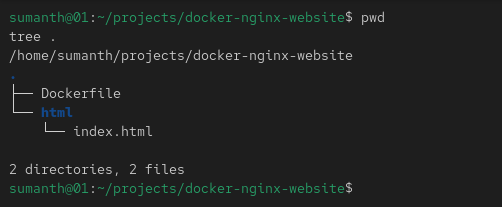
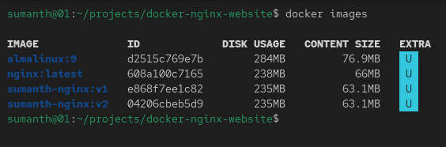
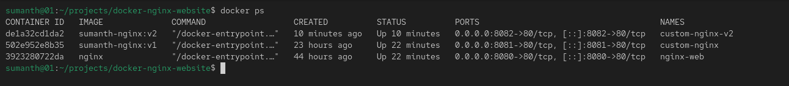
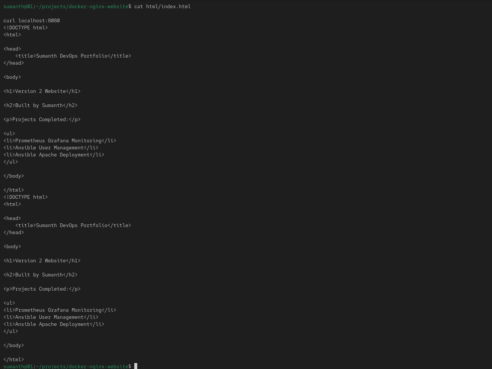
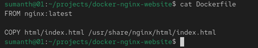
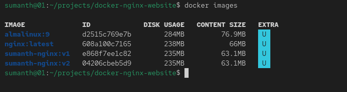
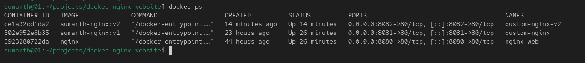
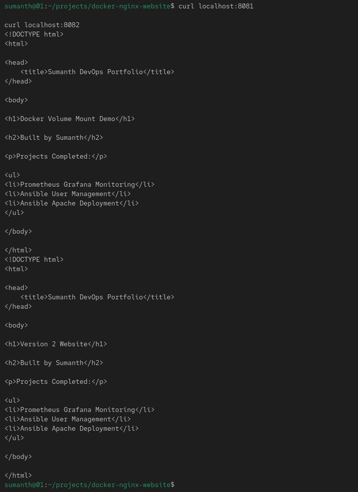
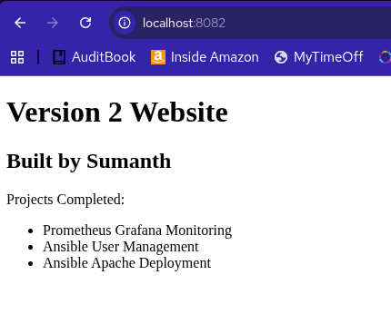
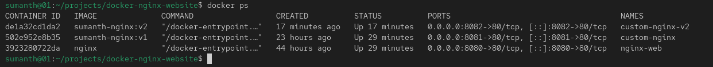

# Docker Nginx Website Deployment

## Overview

This project demonstrates how to deploy a custom website using Docker and Nginx.

The objective was to understand core Docker concepts including:

* Docker Images
* Docker Containers
* Port Mapping
* Volume Mounts
* Dockerfile Creation
* Custom Image Building
* Image Versioning
* Container Networking

---

## Technologies Used

* Docker
* Nginx
* HTML

---

## Project Architecture

```text
Host Machine
    |
    +--> nginx-web (Volume Mount)
    |        |
    |        +--> Port 8080
    |
    +--> custom-nginx (Image v1)
    |        |
    |        +--> Port 8081
    |
    +--> custom-nginx-v2 (Image v2)
             |
             +--> Port 8082
```

---

## 1. Project Structure



---

## 2. Pulling Nginx Image

Downloaded the official Nginx image from Docker Hub.



---

## 3. Running a Volume Mounted Container

Created a container that serves website files directly from the host system.



---

## 4. Volume Mount Demonstration

Changes made on the host machine are immediately reflected inside the running container without rebuilding the image.



---

## 5. Dockerfile

Created a custom Docker image using the following Dockerfile:

```dockerfile
FROM nginx:latest

COPY html/index.html /usr/share/nginx/html/index.html
```



---

## 6. Building a Custom Docker Image

Built a custom image named:

```text
sumanth-nginx:v1
```



---

## 7. Running the Custom Image

Started a container from the custom image and exposed it through port 8081.



---

## 8. Docker Image Versioning

Created and deployed multiple image versions.

Version 1:

```text
sumanth-nginx:v1
```

Version 2:

```text
sumanth-nginx:v2
```



---

## 9. Final Website Output

Verified the website deployment through Nginx.



---

## 10. Container Networking

Verified multiple containers running simultaneously with different port mappings.



---

## Key Concepts Learned

* Docker Images
* Docker Containers
* Docker Hub
* Port Mapping
* Volume Mounts
* Dockerfile
* Image Creation
* Image Versioning
* Container Networking
* Nginx Deployment

---

## Installation Guide

### Pull Nginx Image

```bash
docker pull nginx
```

### Run Nginx with Volume Mount

```bash
docker run -d \
--name nginx-web \
-p 8080:80 \
-v $(pwd)/html:/usr/share/nginx/html:ro \
nginx
```

### Build Custom Image

```bash
docker build -t sumanth-nginx:v1 .
```

### Run Custom Image

```bash
docker run -d \
--name custom-nginx \
-p 8081:80 \
sumanth-nginx:v1
```

### Build Version 2

```bash
docker build -t sumanth-nginx:v2 .
```

### Run Version 2

```bash
docker run -d \
--name custom-nginx-v2 \
-p 8082:80 \
sumanth-nginx:v2
```

### Verify

```bash
curl localhost:8080
curl localhost:8081
curl localhost:8082
```

---

## Repository Structure

```text
docker-nginx-website/
│
├── Dockerfile
├── README.md
│
├── html/
│   └── index.html
│
├── screenshots/
│   ├── 01-project-structure.png
│   ├── 02-nginx-image-pull.png
│   ├── 03-volume-mounted-container.png
│   ├── 04-volume-mount-demo.png
│   ├── 05-dockerfile.png
│   ├── 06-build-custom-image.png
│   ├── 07-custom-image-running.png
│   ├── 08-image-versioning-v1-v2.png
│   ├── 09-final-website-output.png
│   └── 10-container-networking.png
│
└── documents/
    └── installation-guide.md
```

---

## Author

**Sumanth**

Linux System Administrator | DevOps Learner
